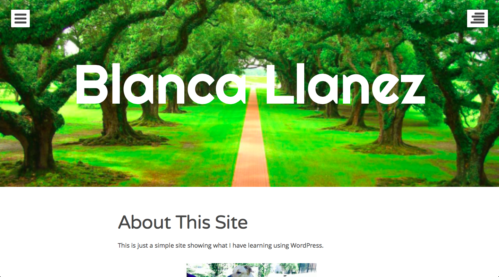
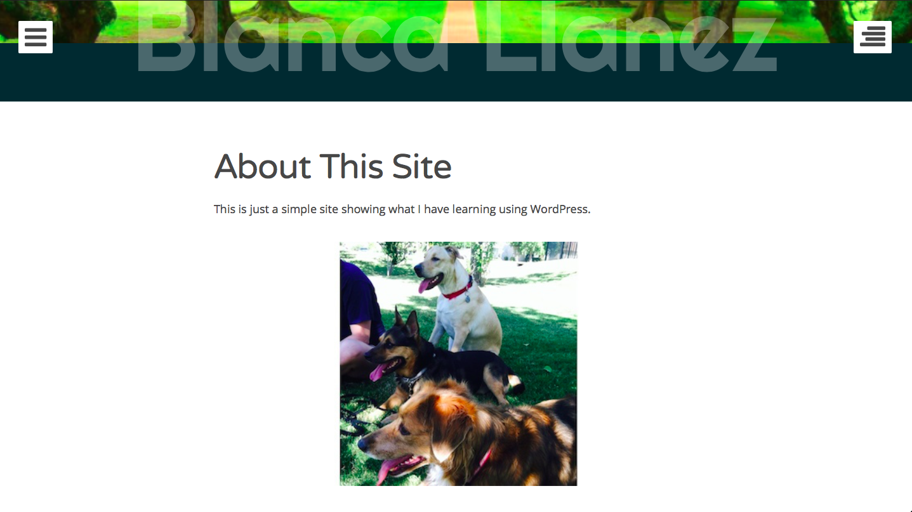
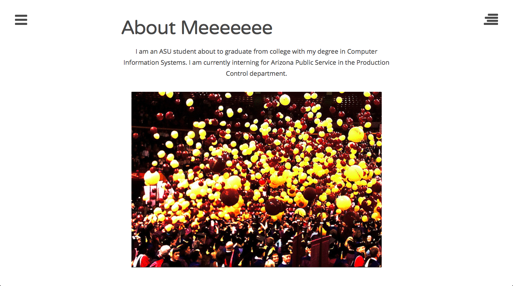
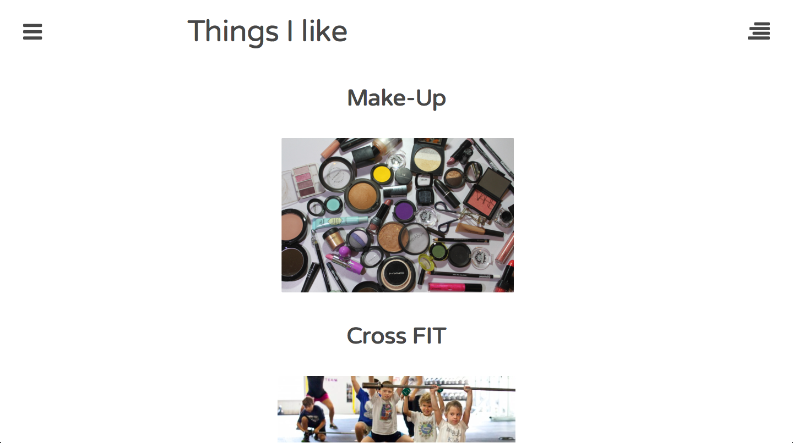
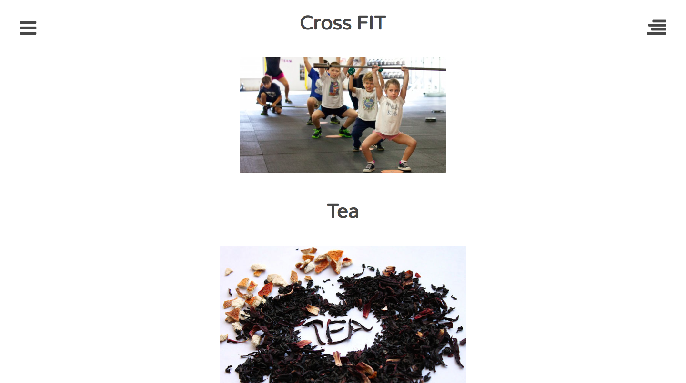
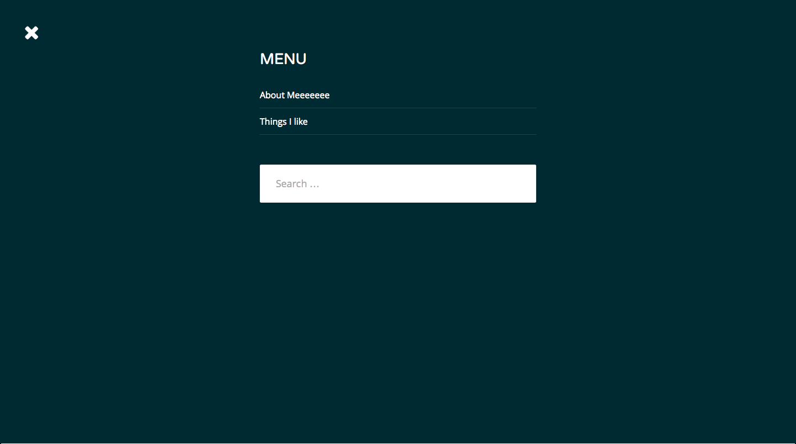
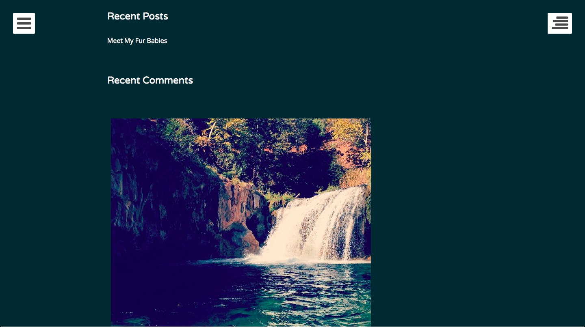
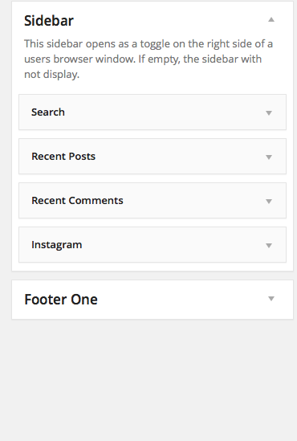
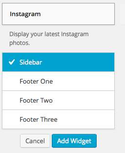

Blanca's Personal Project 
============================

More than anything this group project taught me how to work well with people more than anything. I was expecting to build a website from scratch, but the ability to learn WordPress was 
sort of a blessing. It is simple to use and easy to learn, and extremely quick. It gives anyone the build a website. I really enjoyed learning more about WordPress and being able
to work with SkyTouch to see how to take a WordPress and transform it into something better than just a regular theme. 

Pages
============================
This is just a simple set up of the webpages.

Plug In Example
============================

This is how to install the Instagram widget, then all you have to allow WordPress access to your Instagram.
 

This shows where your INstagram images will be placed on the pages.

This is the final example. 

